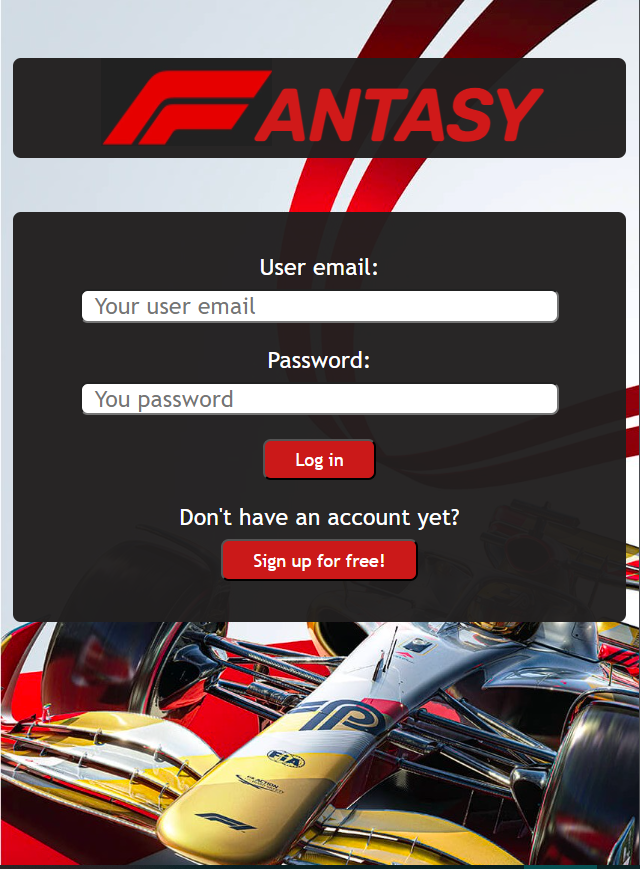
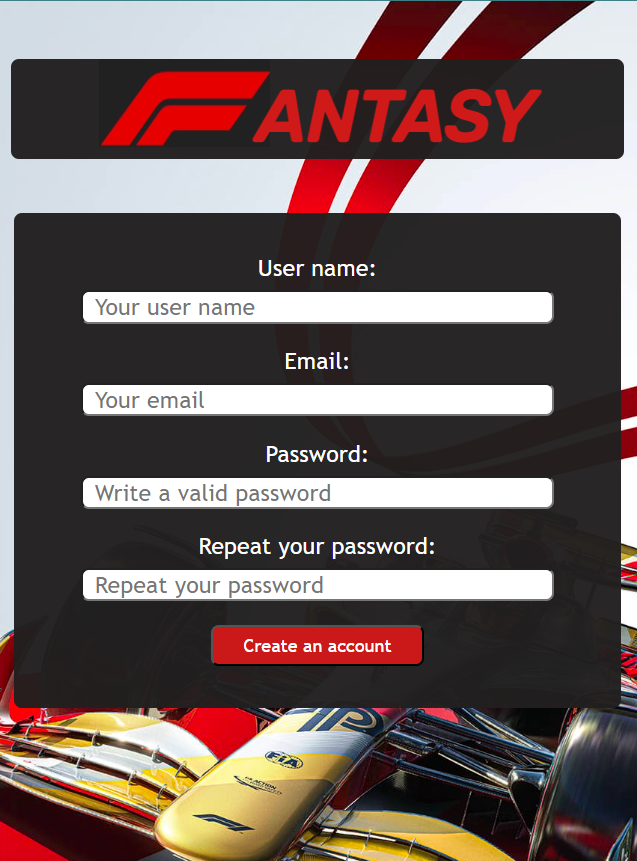
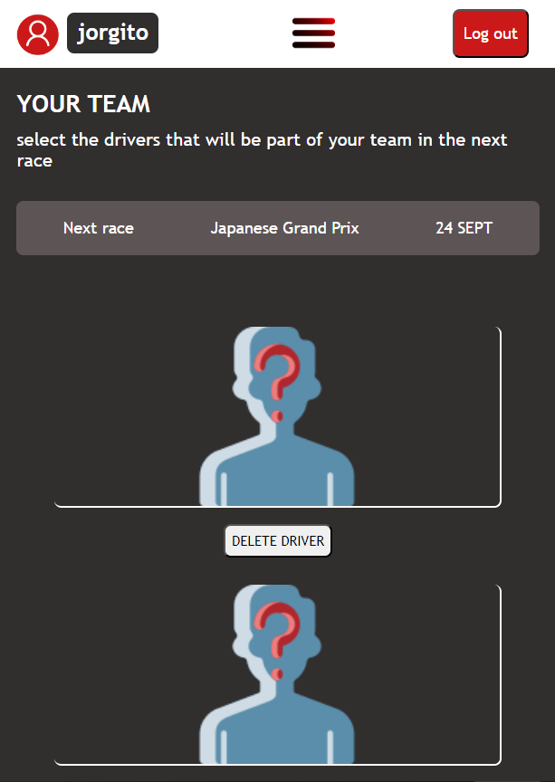
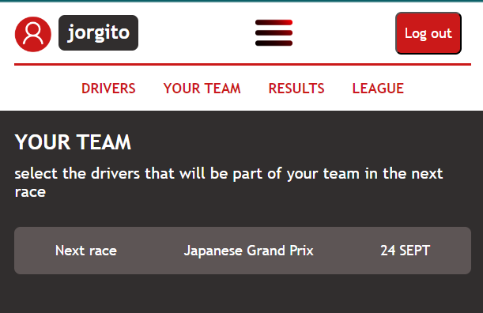

# Fantasy F1 App

Esta es una aplicación web creada para los amantes de la Fórmula 1. Permite a los usuarios participar en un juego fantasy donde podrán crear un equipo virtual seleccionando 3 de los 20 pilotos actuales de la parrilla de Fórmula 1. Después de cada Gran Premio, los pilotos seleccionados recibirán una puntuación en función de su actuación en la carrera real, y los usuarios podrán ver su puntuación total y su posición en una liga con otros usuarios.

## Funciones Implementadas hasta el momento

- Registro y autenticación de usuarios a través de Firebase Auth.
- Identificación de usuarios mientras están en sesión.

- Mostrar información actualizada de los pilotos y estadísticas de la Fórmula 1 obtenida mediante una API externa.
- Elección de pilotos por parte del usuario y guardar la información en una base de datos Firestore.
- Acceso a base de datos Firebase para autenticación y almacenamiento de información del juego.

## API de Fórmula 1

Para obtener información y datos de los pilotos, se ha utilizado la API de Fórmula 1 de [API Sports](https://api-sports.io/documentation/formula-1/v1). Esta API proporciona estadísticas, información sobre los pilotos y más. Como programador, necesitarás una API key para acceder a ella. Puedes obtener una API key registrándote en [API Football](https://dashboard.api-football.com/) y siguiendo los pasos para obtener tu clave de API.

Una vez que obtengas tu clave de API, deberás configurarla en tu archivo de configuración o en el código correspondiente de la aplicación para realizar solicitudes a la API y obtener los datos necesarios.

## Estructura del Repositorio

El repositorio contiene los siguientes archivos y carpetas:

- `index.html`: Página de inicio con las opciones de inicio de sesión y registro.
- `home.html`: Página principal de la sesión de usuario, donde se muestra el equipo y la puntuación del usuario.

- `drivers.html`: Biblioteca de pilotos disponibles para el juego.
- `style.css`: Archivo CSS para los estilos de la aplicación.
- `script.js`: Archivo JavaScript con la configuración y funcionalidades de la aplicación.
- Carpeta `assets`: Contiene imágenes e iconos utilizados en la aplicación.

## Próximas Implementaciones

- Leer datos de la base de datos para mostrar en `home.html` los pilotos elegidos por usuario en `drivers.html`.
- Crear `results.html` para mostrar la puntuación del usuario después de cada carrera, incluyendo gráficos y resultados reales de los Grandes Premios.
- Implementar `league.html` para permitir a los usuarios competir y comparar su puntuación con otros usuarios en una liga.

## Tecnologías Utilizadas

- Firebase (Auth y Firestore) para la autenticación y base de datos.
- HTML, CSS y JavaScript para la estructura, diseño y funcionalidades de la aplicación.
- API de Fórmula 1 de [API Sports](https://api-sports.io/documentation/formula-1/v1) para obtener información actualizada de los pilotos.

¡Disfruta del juego fantasy de Fórmula 1!
